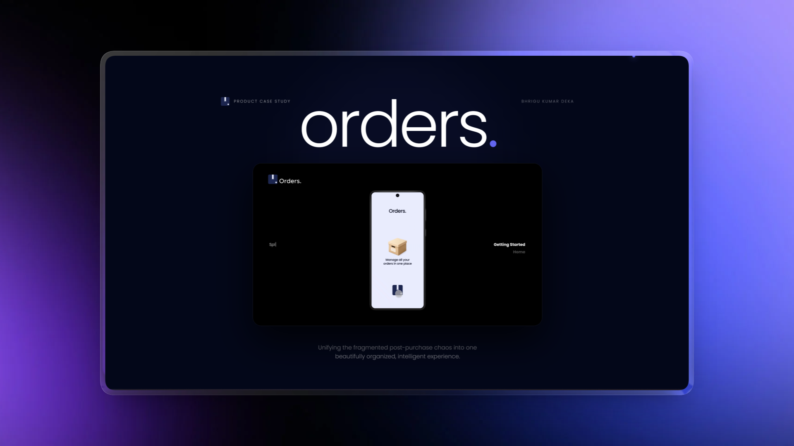

<p align="center">
  
</p>

<h1 align="center">orders<span style="color:#6366f1">.</span></h1>

<p align="center">
  A high-fidelity UX/UI product case study — unifying the fragmented post-purchase experience into one intelligent, beautifully designed hub.
</p>

<p align="center">
  <a href="https://www.figma.com/proto/0Ym2EXSxhoravrc2XL7vYM/Orders?page-id=111%3A535&node-id=149-35&viewport=4358%2C156%2C0.39&t=a2l76HHOhGy7TyeH-1&scaling=scale-down&content-scaling=fixed&starting-point-node-id=149%3A35">
    
  </a>
  &nbsp;
  
  &nbsp;
  
  &nbsp;
  
  &nbsp;
  
</p>

---

## ✦ Overview

**Orders** is a UX/UI case study for a unified order management app that consolidates purchases from multiple e-commerce platforms (Amazon, Myntra, Blinkit, etc.) into a single, intelligent dashboard. The landing page itself is an editorial-style, motion-rich case study site — built to showcase the product's research, design decisions, and final solution.

> *"Unifying the fragmented post-purchase chaos into one beautifully organized, intelligent experience."*

---

## ✦ Sections

| Section | Description |
|---|---|
| **Hero** | Full-screen dark intro with animated title and embedded product demo video |
| **About / Bento Grid** | Project overview with animated stat counters and a generative network SVG |
| **Interactive Prototype** | Embedded live Figma prototype (iframe) with fullscreen link |
| **The Problem** | Research-driven problem statement highlighting the fragmentation pain point |
| **User Personas** | Janhvi Mehta & Aarav Malhotra — two distinct user personas with photos and quote callouts |
| **The Solution** | Bento-grid layout showcasing app screens: Home, History, Banner & Hero views |
| **Footer** | Typographic large-type footer with smooth scroll-to-top |

---

## ✦ Key Stats (Research Findings)

- **100%** of users track orders via individual apps
- **52%** have missed return deadlines
- **63%** want smart purchase suggestions
- **97.5** SUS (System Usability Scale) score

---

## ✦ Tech Stack

| Tool | Purpose |
|---|---|
| **React 19** | Component-based UI |
| **Vite 7** | Lightning-fast dev server & build |
| **Tailwind CSS 3** | Utility-first styling |
| **Framer Motion / motion** | Scroll-driven & gesture animations |
| **Lucide React** | Iconography |
| **Figma** | Prototyping & design system |

---

## ✦ Design Highlights

- **Comet cursor trail** — 8-point spring-physics trailing dot in indigo/violet
- **Preloader** — Logo reveal + pulse animation before main content appears
- **Blur-reveal text** — Word-by-word stagger animation with blur + y-offset
- **Flowing SVG dividers** — Scroll-driven path-drawing wave separators
- **Parallax hero** — Scroll-linked `y` + opacity transform on the hero panel
- **Animated stat counters** — Smooth eased number animation triggered by viewport entry
- **Bento grid layouts** — Responsive asymmetric card grids for About & Solution sections
- **Generative network SVG** — Animated node-and-edge graph built in plain SVG + Motion

---

## ✦ Getting Started

### Prerequisites

- Node.js ≥ 18
- npm ≥ 9

### Installation

```bash
# Clone the repository
git clone https://github.com/BhriguKumarDeka/orders.git
cd orders

# Install dependencies
npm install
```

### Development

```bash
npm run dev
# → http://localhost:5173
```

### Production Build

```bash
npm run build
npm run preview
```

---

## ✦ Project Structure

```
orders/
├── docs/
│   └── preview.png          # README hero image
├── src/
│   ├── public/              # Static assets (images, video, logo)
│   │   ├── logo.png
│   │   ├── orders-product.mp4
│   │   ├── orders-ui.png
│   │   ├── orders-home.png
│   │   ├── orders-history.png
│   │   ├── orders-banner.png
│   │   ├── orders-hero.png
│   │   ├── orders-handheld.png
│   │   ├── Aarav.png
│   │   └── Janhvi.png
│   ├── App.jsx              # Single-file case study (all sections)
│   ├── index.css            # Global styles & Tailwind config
│   └── main.jsx             # React entry point
├── index.html
├── tailwind.config.js
├── vite.config.js
└── package.json
```

---

## ✦ Live Prototype

Interact with the full Figma prototype here:

🔗 [**Open in Figma →**](https://www.figma.com/proto/0Ym2EXSxhoravrc2XL7vYM/Orders?page-id=111%3A535&node-id=149-35&viewport=4358%2C156%2C0.39&t=a2l76HHOhGy7TyeH-1&scaling=scale-down&content-scaling=fixed&starting-point-node-id=149%3A35)

---

## ✦ Author

**Bhrigu Kumar Deka**

Designed and developed as an end-to-end UX/UI case study — from user research and persona definition through to high-fidelity prototyping and this motion-driven case study site.

---

<p align="center">
  <sub>© 2026 Orders Inc. · UX/UI Case Study</sub>
</p>
